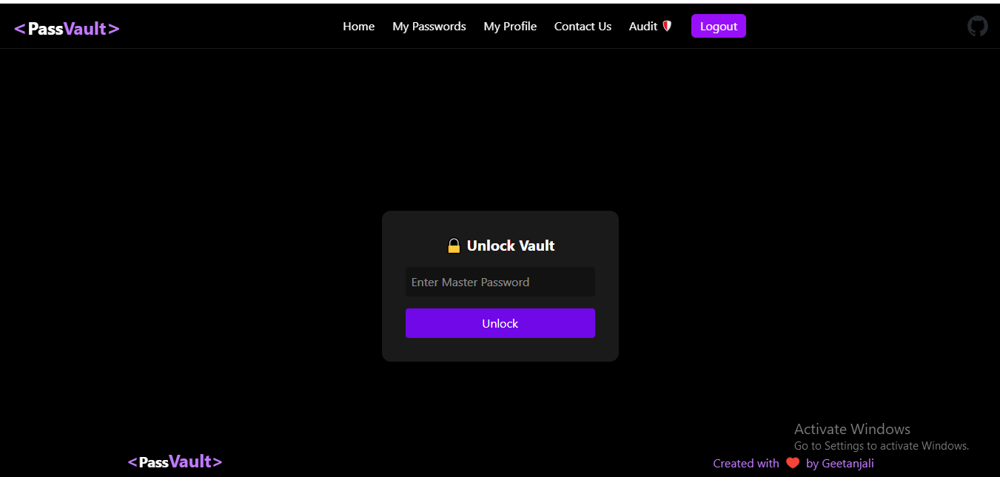
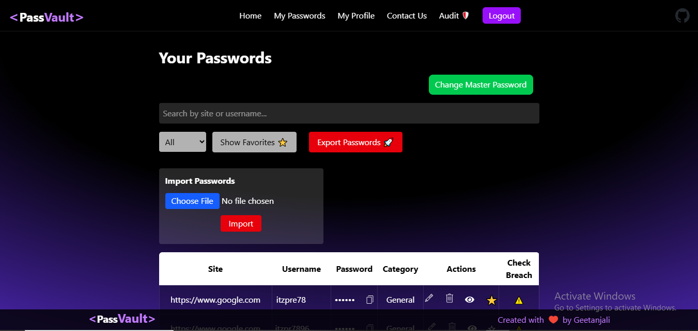
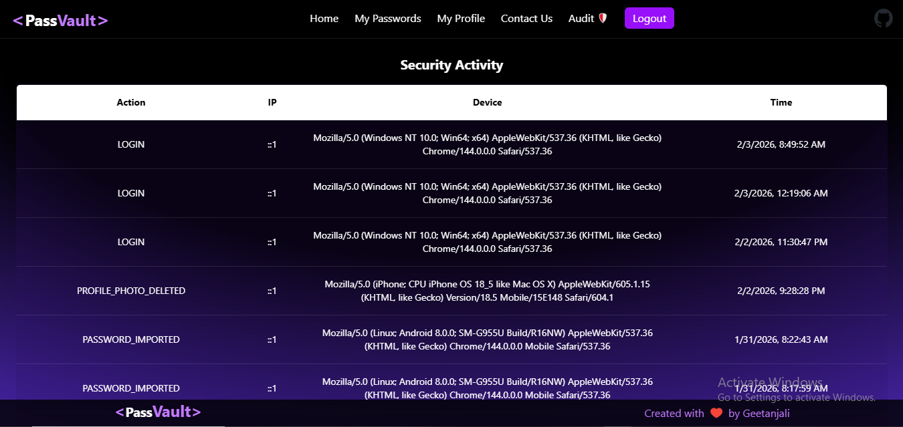

# 🔐 Secure Password Manager — MERN Stack

A **production-grade Password Manager** built using the MERN stack with a strong focus on  
**security, encryption, usability, and real-world architecture**.

This application allows users to safely store, manage, and audit their credentials inside a protected vault — similar in concept to tools like Bitwarden or 1Password.

---
# 🚀 Live Demo

🌐 Frontend: https://pass-vault-secure-password-manager-two.vercel.app

🔗 Backend API: https://passvault-backend-ikj0.onrender.com

✅ Health Check Endpoint: https://passvault-backend-ikj0.onrender.com/api/health

⚠️ Note: Signup/Login is enabled, but abuse is prevented using OTP throttling + rate limiting.

⚠️ Demo credentials available on request (for security reasons).

# 🎯 Why This Project Stands Out

Most password manager projects stop at saving encrypted data. This project goes much further and mirrors real security products:

✔ Zero‑knowledge‑inspired architecture
✔ Client‑side encryption before data reaches the server
✔ Secure session & refresh token handling
✔ Vault auto‑locking and trusted devices
✔ Audit logging & rate limiting
✔ Built with security reviews, scalability, and recruiters in mind.
---

## 📌 Resume-Ready Project Summary

PassVault is a **security-first password manager** built with the MERN stack, implementing a **zero-knowledge-inspired vault architecture** where all sensitive credentials are encrypted client-side before reaching the backend.

The system includes **OTP-based login verification**, **trusted device binding**, **refresh token rotation**, and **audit logging** to mirror real-world authentication workflows used in modern security products.

Designed as a production-grade project showcasing expertise in:

- Secure authentication & session management  
- Encryption-based vault systems  
- Scalable backend API engineering  
- Real-world security practices & monitoring 

### ✨ Core Features
# 🔐 Authentication & Account Security

✔ Secure signup & login flow
✔ Email‑based OTP verification
✔ Two‑Factor Authentication (2FA)
✔ Refresh token rotation
✔ Trusted device tracking
✔ Session restore & auto logout

# 🧠 Zero‑Knowledge Vault Architecture
✔ Client‑side encryption (server never sees plaintext secrets)
✔ Encrypted password storage
✔ Master password never stored
✔ Vault auto‑locks after inactivity
✔ Manual vault lock/unlock

# 🗄️ Password Vault
✔ Add, edit, delete credentials
✔ Masked password display
✔ Show / hide passwords
✔ One‑click secure clipboard copy (auto‑clear)
✔ Password search & filtering
✔ Responsive table + mobile card views

# 📜 Audit Logs & Monitoring
✔ Login/logout tracking 
✔ Password add/edit/delete events logs
✔ IP address & device metadata
✔ Vault access monitoring
✔ Tamper-resistant backend audit architecture 

# 🛡️ Advanced Security Features
✔ Password strength meter (zxcvbn)
✔ Breach detection checks
✔ Rate limiting on sensitive endpoints
✔ Secure error handling (no info leakage)
✔  CSRF-safe authentication via cookies + tokens 

# 📦 Additional Capabilities
✔ Import / Export passwords
✔ Profile photo upload
✔ Contact‑Us email integration
✔ Toast‑based UX feedback
✔ Axios interceptors for auth refresh
✔ Fully responsive Tailwind UI

# 🖼️ Screenshots
🔑 Authentication
 

🗄️ Vault Dashboard
 

📜 Audit Logs
 

📌 Screenshots are stored in the /screenshots directory.

🛠️ Tech Stack
### Frontend
✔ React.js (Vite)
✔ Tailwind CSS
✔ Axios
✔ React Router
✔ Zxcvbn password scoring

### Backend
✔ Node.js
✔ Express.js
✔ MongoDB
✔ Mongoose
✔ JWT (Access & Refresh Tokens)

### Security
✔ Client‑side encryption
✔ Zero‑knowledge principles
✔ Secure session handling
✔ Protected API routes
✔ Rate limiting & audit logging

📂 Project Structure
# frontend/ — React + Tailwind UI
# backend/ — Node.js API & security logic
# screenshots/ — UI previews

🔒 Security Notes
✔ Passwords are encrypted before reaching the backend
✔ Backend never stores plaintext credentials
✔ Master password is never saved
✔ Error responses are intentionally generic
✔ Logs never expose sensitive data

🚀 Deployment
✔ Frontend: Vercel
✔ Backend: Render
✔ Database: MongoDB Atlas

# 📡 API Endpoint Documentation

All endpoints are prefixed with:`/api`
## 🔐 Authentication Routes

| Method | Endpoint | Description |
|-------|----------|-------------|
| POST  | `/auth/signup` | Register new user with vault initialization |
| POST  | `/auth/login` | Login + triggers OTP if device not trusted |
| POST  | `/auth/verify-otp` | Verify OTP and complete login |
| POST  | `/auth/refresh` | Refresh access token (rotation + device binding) |
| POST  | `/auth/logout` | Logout and revoke refresh token |
| GET   | `/auth/me` | Get current logged-in user profile 

---

## 🗄️ Vault Password Routes (Protected)

| Method | Endpoint | Description |
|-------|----------|-------------|
| GET   | `/passwords` | Fetch all encrypted vault credentials |
| POST  | `/passwords` | Add a new encrypted password entry |
| PUT   | `/passwords/:id` | Update an existing vault entry |
| DELETE| `/passwords/:id` | Delete a password entry |
| PATCH | `/passwords/:id/favorite` | Toggle favorite credentials |
| PUT   | `/passwords/rotate-vault` | Rotate vault encryption after master password change |

---

## 📜 Audit Logging Routes

| Method | Endpoint | Description |
|-------|----------|-------------|
| GET   | `/audit` | View login + vault activity logs |

---

## 🛡️ Security Utility Routes

| Method | Endpoint | Description |
|-------|----------|-------------|
| POST  | `/breach-check` | Check password exposure using HIBP API |

---

## 📩 Contact Routes

| Method | Endpoint | Description |
|-------|----------|-------------|
| POST  | `/contactUs` | Send contact form message via email provider |

---

## ✅ Health Check

| Method | Endpoint | Description |
|-------|----------|-------------|
| GET   | `/health` | Backend uptime + deployment status |

---

### 👨‍💻 Author

Geetanjali
MERN Stack Developer | Security‑Focused Full‑Stack Engineer

GitHub: https://github.com/geet182022-prog
LinkedIn: https://www.linkedin.com/in/geetanjali-96a099284/

## 📌 Disclaimer

This project is built for educational and portfolio purposes. It demonstrates real‑world security concepts but should be independently audited before any commercial use.